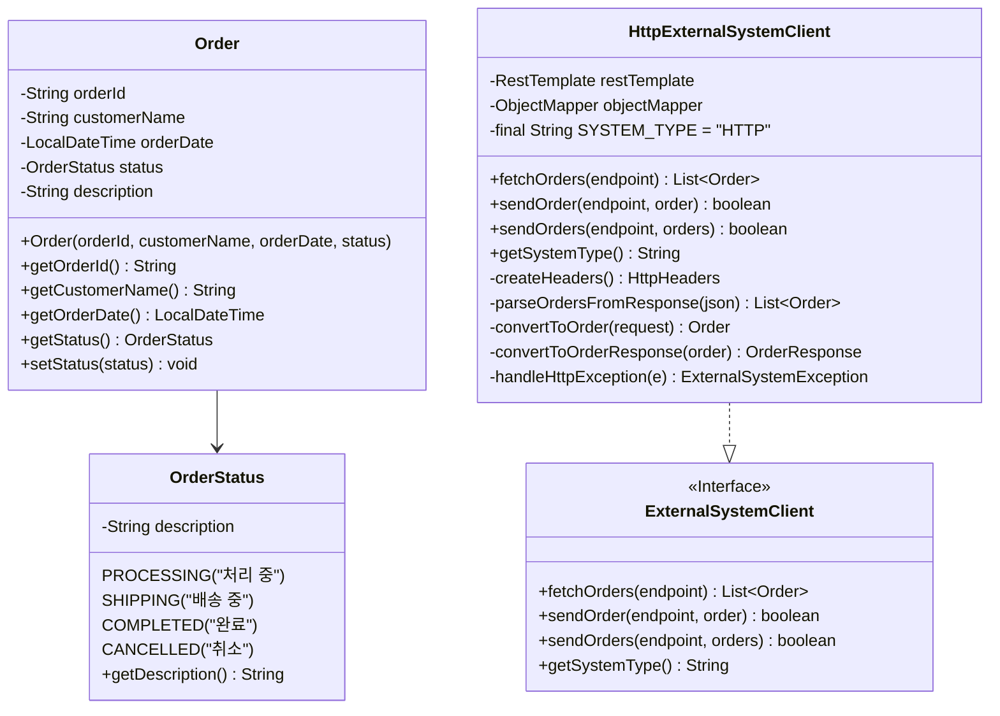
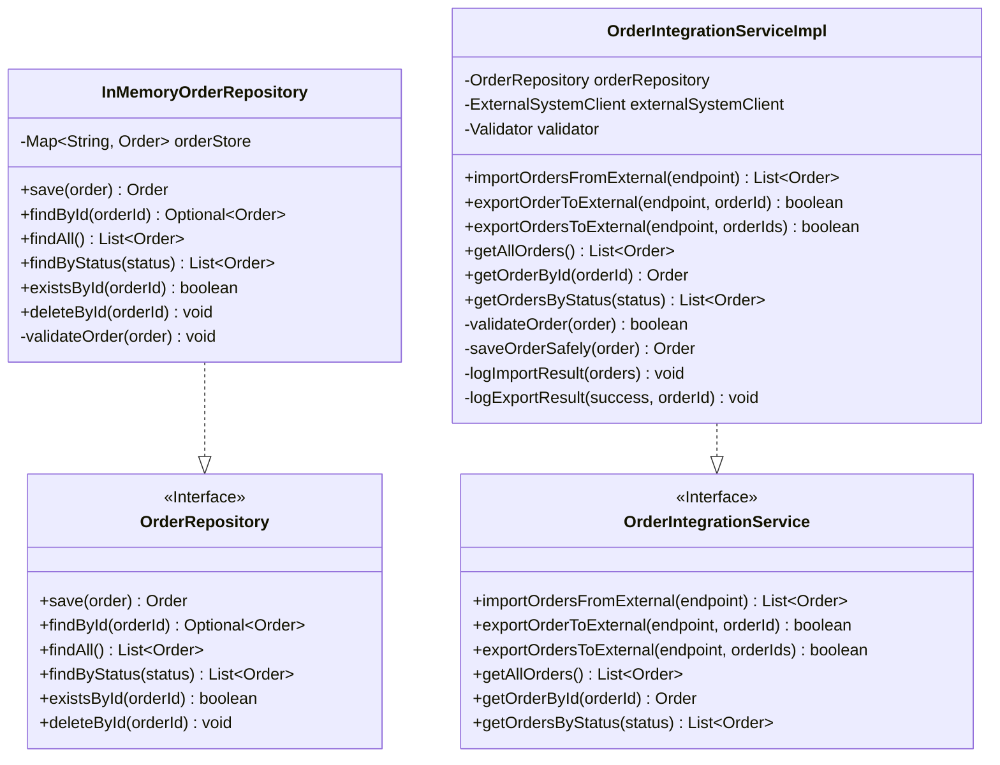

# 주문 데이터 연동 시스템 (Order Integration System)

## 프로젝트 개요

외부 시스템과의 주문 데이터 연동을 위한 Spring Boot 기반 REST API 시스템입니다. HTTP/JSON 통신을 통해 외부 시스템으로부터 주문 데이터를 가져와 저장하고, 내부 데이터를 외부 시스템으로 전송하는 기능을 제공합니다.

## 시스템 아키텍처

### 전체 구조
```
┌─────────────────┐   HTTP/JSON   ┌─────────────────┐       ┌─────────────────┐
│  External       │ ←───────────→ │  Order          │ ────→ │  In-Memory      │
│  System         │               │  Integration    │       │  Storage        │
└─────────────────┘               │  System         │       └─────────────────┘
                                  └─────────────────┘

```

### 계층별 구조
```
┌─────────────────────────────────────────────────────────┐
│                  REST API Layer                         │
│              OrderIntegrationController                 │
└─────────────────────────────────────────────────────────┘
                            │
┌─────────────────────────────────────────────────────────┐
│                Business Logic Layer                     │
│             OrderIntegrationService                     │
└─────────────────────────────────────────────────────────┘
                            │
┌─────────────────────────────────────────────────────────┐
│              Integration & Storage Layer                │
│    ExternalSystemClient  │  OrderRepository             │
└─────────────────────────────────────────────────────────┘
```

### 디렉터리 구조
```
src/
├── main/
│   ├── java/
│   │   └── com/humanson/orderintegration/
│   │       ├── OrderIntegrationApplication.java
│   │       ├── domain/
│   │       │   ├── Order.java
│   │       │   └── OrderStatus.java
│   │       ├── exception/
│   │       │   ├── DataIntegrationException.java
│   │       │   ├── ExternalSystemException.java
│   │       │   ├── OrderNotFoundException.java
│   │       │   └── GlobalExceptionHandler.java
│   │       ├── client/
│   │       │   ├── dto/
│   │       │   │   ├── OrderRequest.java
│   │       │   │   ├── OrderResponse.java
│   │       │   │   └── ExternalSystemResponse.java
│   │       │   ├── ExternalSystemClient.java
│   │       │   └── HttpExternalSystemClient.java
│   │       ├── repository/
│   │       │   ├── OrderRepository.java
│   │       │   └── InMemoryOrderRepository.java
│   │       ├── service/
│   │       │   ├── OrderIntegrationService.java
│   │       │   └── OrderIntegrationServiceImpl.java
│   │       ├── controller/
│   │       │   ├── dto/
│   │       │   │   ├── ImportOrdersRequest.java
│   │       │   │   ├── ExportOrderRequest.java
│   │       │   │   ├── ExportOrdersRequest.java
│   │       │   │   └── ApiResponse.java
│   │       │   └── OrderIntegrationController.java
│   │       └── config/
│   │           └── IntegrationConfig.java
│   └── resources/
│       └── application.yml
└── test/
    └── java/
        └── com/humanson/orderintegration/
            ├── client/
            │   └── HttpExternalSystemClientTest.java
            ├── controller/
            │   └── OrderIntegrationControllerTest.java
            ├── repository/
            │   └── InMemoryOrderRepositoryTest.java
            └── service/
                └── OrderIntegrationServiceTest.java
```

## 주요 기능

### 1. 주문 데이터 연동
- **Import**: 외부 시스템에서 주문 데이터 가져오기
- **Export**: 내부 주문 데이터를 외부 시스템으로 전송
- **실시간 연동**: HTTP 기반 즉시 데이터 교환

### 2. 주문 관리
- 주문 생성, 조회, 상태 관리
- 상태별 주문 필터링 (처리중, 배송중, 완료, 취소)
- 인메모리 저장소를 통한 빠른 데이터 액세스

### 3. 예외 처리
- 네트워크 오류 처리
- 데이터 형식 오류 처리
- 비즈니스 로직 예외 처리
- 전역 예외 핸들링

## 시스템 설계

### 1. 도메인 모델 & 2. 외부 시스템 연동



### 3. 데이터 저장소 & 4. 비즈니스 로직



## 기술 스택

- **Framework**: Spring Boot 3.5.3
- **언어**: Java 21
- **HTTP Client**: RestTemplate
- **JSON 처리**: Jackson
- **유효성 검증**: Bean Validation
- **테스트**: JUnit 5, Mockito
- **로깅**: SLF4J
- **빌드 도구**: Gradle

## API 엔드포인트

### 주문 데이터 Import
```http
POST /api/orders/import
Content-Type: application/json

{
  "endpoint": "http://external-system.com/orders"
}
```

### 주문 데이터 Export (단일)
```http
POST /api/orders/export/{orderId}
Content-Type: application/json

{
  "endpoint": "http://external-system.com/orders"
}
```

### 주문 데이터 Export (다중)
```http
POST /api/orders/export
Content-Type: application/json

{
  "endpoint": "http://external-system.com/orders",
  "orderIds": ["ORDER001", "ORDER002"]
}
```

### 주문 조회
```http
GET /api/orders                    # 전체 주문 조회
GET /api/orders/{orderId}          # 특정 주문 조회
GET /api/orders/status/{status}    # 상태별 주문 조회
```

## 데이터 형식

### 주문 데이터 (Order)
```json
{
  "orderId": "ORDER001",
  "customerName": "고객명",
  "orderDate": "2024-01-01T10:00:00",
  "status": "PROCESSING",
  "description": "주문 설명"
}
```

### API 응답 형식
```json
{
  "success": true,
  "message": "작업 완료",
  "data": { /* 실제 데이터 */ },
  "timestamp": "2024-01-01T10:00:00"
}
```

### 외부 시스템 연동 데이터

**Import Request Format:**
```json
[
  {
    "orderId": "ORDER001",
    "customerName": "고객명",
    "orderDate": "2024-01-01 10:00:00",
    "status": "PROCESSING",
    "description": "주문 설명"
  }
]
```

**Export Response Format:**
```json
{
  "success": true,
  "message": "데이터 수신 완료",
  "data": null,
  "timestamp": "2024-01-01T10:00:00"
}
```

## 예외 처리

### 예외 계층 구조
```
DataIntegrationException (Base)
├── ExternalSystemException (외부 시스템 통신 오류)
├── OrderNotFoundException (주문 조회 실패)
└── DataFormatException (데이터 형식 오류)
```

### 주요 예외 상황
- **네트워크 오류**: 외부 시스템 연결 실패
- **HTTP 오류**: 4xx, 5xx 응답 코드
- **데이터 형식 오류**: JSON 파싱 실패, 필드 누락
- **비즈니스 로직 오류**: 주문 ID 중복, 유효성 검증 실패

## 테스트

### 테스트 구조
```
src/test/java/
├── unit/                          # 단위 테스트
│   ├── OrderIntegrationServiceTest
│   ├── HttpExternalSystemClientTest
│   └── InMemoryOrderRepositoryTest
└── integration/                   # 통합 테스트
    └── OrderIntegrationControllerTest
```

### 테스트 실행
```bash
# 모든 테스트 실행
mvn test

# 특정 테스트 클래스 실행
mvn test -Dtest=OrderIntegrationServiceTest

# 통합 테스트만 실행
mvn test -Dtest=*IntegrationTest
```

## 🚀 실행 방법

### 1. 프로젝트 빌드
```bash
mvn clean compile
```

### 2. 애플리케이션 실행
```bash
mvn spring-boot:run
```

### 3. 애플리케이션 접속
```
http://localhost:8080
```

## 사용 예시

### 1. 외부 시스템에서 주문 데이터 가져오기
```bash
curl -X POST http://localhost:8080/api/orders/import \
  -H "Content-Type: application/json" \
  -d '{"endpoint": "http://external-system.com/orders"}'
```

### 2. 주문 데이터 외부 시스템으로 전송
```bash
curl -X POST http://localhost:8080/api/orders/export/ORDER001 \
  -H "Content-Type: application/json" \
  -d '{"endpoint": "http://external-system.com/orders"}'
```

### 3. 저장된 주문 조회
```bash
curl http://localhost:8080/api/orders
```

## 확장성 고려사항

### 1. 다양한 외부 시스템 지원
- `ExternalSystemClient` 인터페이스를 구현하여 새로운 통신 방식 추가 가능
- FTP, SOAP, GraphQL 등 다양한 프로토콜 지원 가능

### 2. 데이터 저장소 변경
- `OrderRepository` 인터페이스를 통한 저장소 추상화
- JPA, MongoDB 등 다양한 저장소로 쉽게 전환 가능

### 3. 메시지 큐 연동
- 비동기 데이터 연동을 위한 RabbitMQ, Apache Kafka 연동 가능
- 대용량 데이터 처리를 위한 배치 처리 지원

## 참고 자료

- [Spring Boot Documentation](https://spring.io/projects/spring-boot)
- [RestTemplate Guide](https://spring.io/guides/gs/consuming-rest/)
- [Jackson JSON Processing](https://github.com/FasterXML/jackson)

---